    library(tidyverse)
    library(entropy)
    library(ggpubr)
    library(patchwork)
    library(extrafont)
    loadfonts()

    options(dplyr.summarise.inform = FALSE)
    theme_set(theme_bw(base_size = 10))
    theme_update(text = element_text(family = "Linux Libertine Display G"))

    # Read in data from classic bootstrapping (wrepl) and pseudo-bootstrapping (no replacement)
    freqdist_iter <- read.csv('iterdata/freqdist_iter_500.csv', encoding='UTF-8')
    freqdist_iter_wrepl <- read.csv('iterdata/freqdist_iter_500_wrepl.csv', encoding='UTF-8')

    # Relabel suffixes with dash in front (e.g., -heit) and reorder in order of productivity.
    freqdist_iter$suffix <- factor(freqdist_iter$suffix,
                    levels = c("heit", "schaft", "nis"),
                    labels = c('-heit', '-schaft', '-nis'))
    freqdist_iter_wrepl$suffix <- factor(freqdist_iter_wrepl$suffix,
                    levels = c("heit", "schaft", "nis"),
                    labels = c('-heit', '-schaft', '-nis'))

Classic bootstrapping (sampling w/ replacement)
===============================================

Type count
----------

    types_summ_wrepl <- freqdist_iter_wrepl %>% 
      group_by(suffix, sample_size, iter) %>% 
      summarise(n_types = n()) %>% 
      group_by(suffix, sample_size) %>%
      summarise(
        mean_n_types = mean(n_types),
        min = min(n_types),
        max = max(n_types))

    (p_ntypes_wrepl <- types_summ_wrepl %>% 
      ggplot(aes(x=sample_size, y=mean_n_types, colour=suffix)) +
      geom_point()  +
      geom_line() +
      geom_errorbar(aes(ymin = min,
                        ymax = max),
                    alpha = 0.5,
                    width = 0.05) +
      labs(y = 'Count',
           x = 'Sample size (tokens)',
           title = 'Type count',
           colour = element_blank()) +
      scale_x_continuous(trans = 'log10') +
      scale_y_continuous(trans = 'log10') +
      scale_colour_grey(guide = guide_legend(label.theme = element_text(face = "italic", 
                                                                        family = "Linux Libertine Display G",
                                                                        size = 8))) + 
      NULL)

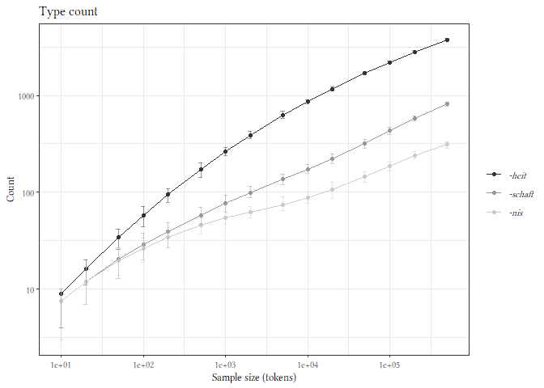

    freqdist_iter_wrepl %>% 
      filter(iter==1 & sample_size == max(sample_size)) %>% 
      group_by(suffix) %>% 
      summarise(ntypes = n())

    ## # A tibble: 3 x 2
    ##   suffix  ntypes
    ##   <fct>    <int>
    ## 1 -heit     3785
    ## 2 -schaft    849
    ## 3 -nis       306

Print out some counts for illustration.

    freqdist_iter_wrepl %>% 
      filter(iter==1 & sample_size %in% c(1e04, 5e05)) %>% 
      group_by(suffix, sample_size) %>% 
      summarise(ntypes = n())

    ## # A tibble: 6 x 3
    ## # Groups:   suffix [3]
    ##   suffix  sample_size ntypes
    ##   <fct>         <int>  <int>
    ## 1 -heit         10000    877
    ## 2 -heit        500000   3785
    ## 3 -schaft       10000    163
    ## 4 -schaft      500000    849
    ## 5 -nis          10000     83
    ## 6 -nis         500000    306

Potential productivity
----------------------

    pp_summ_wrepl <- freqdist_iter_wrepl %>% 
      filter(n_tokens == 1) %>%
      group_by(suffix, iter, sample_size) %>%
      summarise(n_hapaxes = sum(n_tokens)) %>% 
      mutate(pp = n_hapaxes/sample_size) %>% 
      group_by(suffix, sample_size) %>%
      summarise(mean_pp = mean(pp),
                min = min(pp),
                max = max(pp))

    (p_pp_wrepl <- pp_summ_wrepl %>% 
        ggplot(aes(x=sample_size, y=mean_pp, colour=suffix)) +
        geom_point()  +
        geom_line() +
        geom_errorbar(aes(ymin = min,
                          ymax = max),
                      alpha = 0.5,
                      width = 0.05) +
        labs(y = 'Potential productivity',
             x = 'Sample size (tokens)',
             title = 'Potential productivity',
             colour = element_blank()) +
        ylim(c(0,1)) +
        scale_x_continuous(trans = 'log10') +
        scale_colour_grey(guide = guide_legend(label.theme = element_text(face = "italic", 
                                                                          family = "Linux Libertine Display G",
                                                                          size = 8))) + 
        NULL)

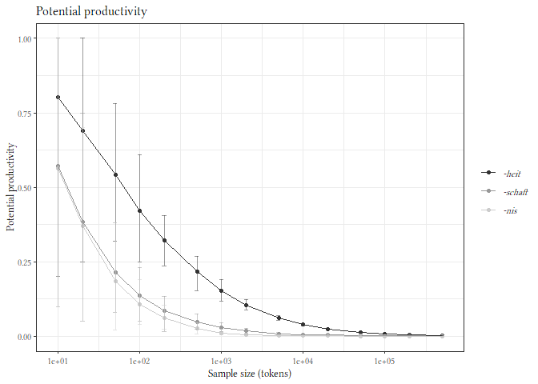

S
-

    get_fZM_S <- function(freqdist){
      # Given a frequency distribution, computes an fZM model on it and returns the estimate of S.
      #
      # Arg:
      #   freqdist: df that contains a column n_tokens: the number of times each type appears.
      # Returns:
      #   Either an integer (the estimate of S for freqdist) or NA (if model parameters couldn't be estimated).
      
      
      # Step 1: Convert freq distribution to a frequency spectrum, format headers the way zipfR likes, 
      # write df to external .spc file (overwritten every time but that's fine), and read back in. 
      # Now ready for use with zipfR.
      # https://github.com/epankratz/diachronic-productivity-thesis/blob/master/scripts-and-data/functions.R#L5
      freqspec <- as.data.frame(table(freqdist$n_tokens))
      names(freqspec) <- c("m", "Vm")
      write.table(freqspec, "iterdata/making_spcs.spc", sep="\t", row.names=FALSE)
      freqspec <- read.spc("iterdata/making_spcs.spc")
      
      # Step 2: Fit a fZM model; get S or, if the model crashes, return NA.
      # https://github.com/epankratz/diachronic-productivity-thesis/blob/master/scripts-and-data/functions.R#L425 
      fzm_s <- tryCatch(
        {
          # The 'try' part: This is the output if there is no error.
          lnre("fzm", freqspec, exact=F)$S
        },
        error=function(error){
          # The 'except' part: Return NA if there is an error, e.g., if parameter estimation fails.
          return(NA)
        }
      )
      
      return(fzm_s)
    }

    s_vec <- freqdist_iter_wrepl %>% 
      group_by(suffix, iter, sample_size) %>% 
      group_map(~ get_fZM_S(.x)) %>% 
      unlist()

    # Get a df of the grouping variables as they were used for group_map()
    # and add the resulting vector as a column. Should match.
    s_iter_wrepl <- freqdist_iter_wrepl %>% 
      select(suffix, iter, sample_size) %>% 
      distinct()
    s_iter_wrepl$s <- s_vec

    write.csv(s_iter_wrepl, 'iterdata/s_iter500_wrepl.csv', row.names=FALSE)

    s_iter_wrepl <- read.csv('iterdata/s_iter500_wrepl.csv')
    s_iter_wrepl$suffix <- factor(s_iter_wrepl$suffix, levels = c('-heit', '-schaft', '-nis'))

    # The S values can be really bizarrely huge sometimes, so I'm going to get rid of the extreme outliers
    # (defined as those more than 1.5 times the IQR away from the 25th and 75% quantile).

    remove_outliers <- function(x) {
      # Function from 
      # https://stackoverflow.com/questions/4787332/how-to-remove-outliers-from-a-dataset/4788102#4788102
      qnt <- quantile(x, probs=c(.25, .75), na.rm = TRUE)
      H <- 1.5 * IQR(x, na.rm = TRUE)
      y <- x
      y[x < (qnt[1] - H)] <- NA
      y[x > (qnt[2] + H)] <- NA
      y
    }

    # If we use dplyr's group_by() and then filter for outliers, we get rid of the entire group if it contains 
    # an outlier, so I'll do it the more tedious way: pivot_wider() to get one sample size as a column and 
    # iterations as rows, make a separate df for each sfx, replace outliers with NA in each col, rbind the 
    # individual dfs together again, and pivot longer.
    s_wide_wrepl <- s_iter_wrepl %>% 
      pivot_wider(values_from = s, names_from = sample_size)

    # Rows 1:50 are -heit, 51:100 are -nis, 101:150 are -schaft.
    # Cols 3:17 are the fifteen different sample sizes.
    no_outl_wide_wrepl <- rbind(
      as.data.frame(lapply(s_wide_wrepl[1:50, 3:17], remove_outliers)),
      as.data.frame(lapply(s_wide_wrepl[51:100, 3:17], remove_outliers)),
      as.data.frame(lapply(s_wide_wrepl[101:150, 3:17], remove_outliers))
    )

    no_outl_iter_wrepl <- cbind(s_wide_wrepl[1:2], no_outl_wide_wrepl) %>% 
      pivot_longer(cols = starts_with('X'), values_to = 's', names_to = 'sample_size') %>% 
      mutate(sample_size = as.numeric(gsub('X', '', sample_size)))

    # Now we can compute the mean and range for the remaining, non-outlier values.
    s_summ_wrepl <- no_outl_iter_wrepl %>%
      group_by(suffix, sample_size) %>%
      summarise(
        mean_s = mean(s, na.rm=TRUE),
        min = min(s, na.rm=TRUE),
        max = max(s, na.rm=TRUE))

### S plot

    (p_s_wrepl <- s_summ_wrepl %>% 
       ggplot(aes(x=sample_size, y=mean_s, colour=suffix)) +
       geom_point()  +
       geom_line() +
       geom_errorbar(aes(ymin = min,
                         ymax = max),
                     alpha = 0.5,
                     width = 0.05) +
       labs(y = 'S',
            x = 'Sample size (tokens)',
            colour = element_blank(),
            title = 'S') +
       scale_x_continuous(trans = 'log10') +
       scale_y_continuous(trans = 'log10',
                          labels = function(x) format(x, scientific = TRUE)) +
       scale_colour_grey(guide = guide_legend(label.theme = element_text(face = "italic", 
                                                                         family = "Linux Libertine Display G",
                                                                         size = 8))) + 
       theme(axis.title.y = element_text(face = "italic"),
             plot.title = element_text(face = "italic")) +
       NULL)

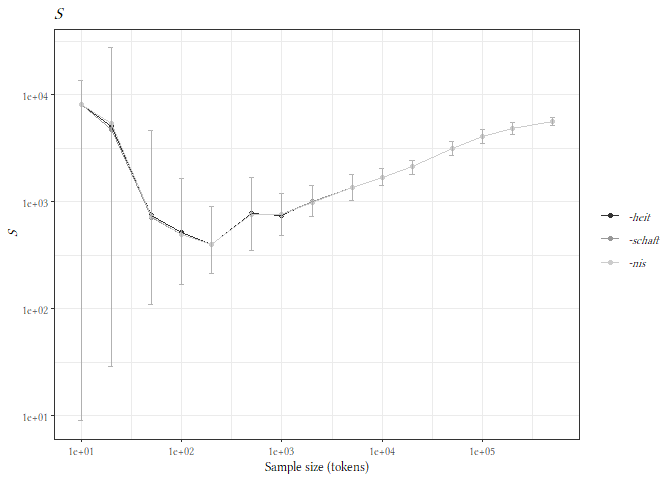

All measures plot
-----------------

    # Combine plots using patchwork (nicely aligns left edge)
    p_ntypes_wrepl / p_pp_wrepl / p_s_wrepl + 
      plot_layout(guides='collect') &
      theme(legend.position='bottom')

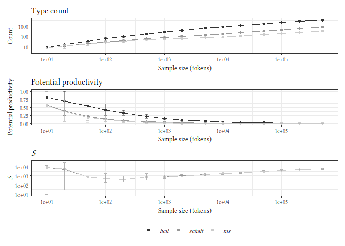

    ggsave('imgs/alt-measures.pdf', device=cairo_pdf, width=10, height=21, units='cm')

Entropy
-------

    # Compute entropy for each sample.
    ent_col_wrepl <- freqdist_iter_wrepl %>% 
      group_by(suffix, iter, sample_size) %>% 
      group_map(~entropy.empirical(.x$n_tokens, unit='log2')) %>% 
      unlist()

    # Get a df of the grouping variables as they were used for group_map(),
    # reorder -nis and -schaft so that they match the factor levels,
    # and add the resulting vector as a column.
    ent_iter_wrepl <- freqdist_iter_wrepl %>% 
      select(suffix, iter, sample_size) %>% 
      distinct()
    ent_iter_wrepl <- rbind(
      ent_iter_wrepl[1:7500,],      # heit
      ent_iter_wrepl[15001:22500,], # schaft
      ent_iter_wrepl[7501:15000,]   # nis
    )
    ent_iter_wrepl$ent <- ent_col_wrepl

    ent_summ_wrepl <- ent_iter_wrepl %>% 
      group_by(suffix, sample_size) %>% 
      summarise(
        mean_ent = mean(ent),
        min = min(ent),
        max = max(ent)
      )

    ent_summ_wrepl %>%   
      ggplot(aes(x=sample_size, y=mean_ent, colour=suffix)) +
      geom_point()  +
      geom_line() +
      geom_errorbar(aes(ymin = min,
                        ymax = max),
                    alpha = 0.5,
                    width = 0.05) +
      labs(y = 'Shannon entropy (bits)',
           x = 'Sample size (tokens)',
           colour = element_blank()) +
      scale_x_continuous(trans = 'log10') +
      scale_colour_grey(guide = guide_legend(label.theme = element_text(face = "italic", 
                                                                        family = "Linux Libertine Display G",
                                                                        size = 8))) +
      NULL

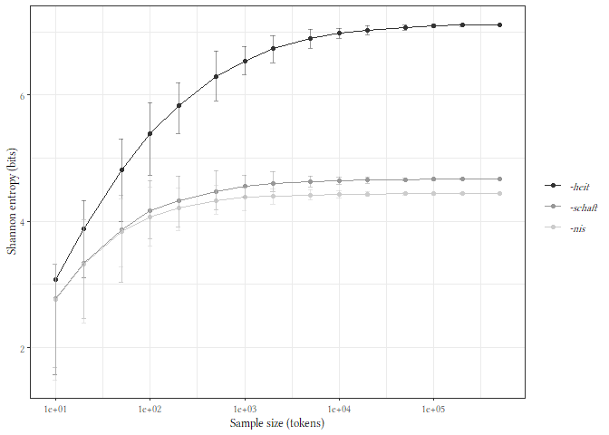

    ggsave('imgs/entropy.pdf', device=cairo_pdf, width=12, height=8, units = 'cm')

VGC
---

These VGCs are cheating a little, because instead of using the order
that the tokens appear in the sample, I’m randomising the order of the
types in the sample. I have to do this because I didn’t save the full
sample in each bootstrapping iteration, just the counts, so I can’t
reconstruct the order. But in practice, most analyses don’t care about
order anyway, and this plot is also so peripheral and just intended as
illustration, so it’s fine.

    make_vgc_data <- function(sample){
      # Gets vocabulary growth data for given sample.
      # Arg:
      #   sample: a vector of tokens
      # Returns:
      #   a data frame in which N is num tokens seen and V is vocab size
      
      emp <- data.frame(matrix(ncol=2))
      names(emp) <- c('N', 'V')
      discovered <- c()
      
      for(idx in 1:length(sample)){
        curr_token <- sample[idx]
        
        # Add token to discovered if previously unseen
        if(!(is.element(curr_token, discovered))){
          discovered <- c(discovered, curr_token)
        }
        
        # Write results to emp; N = idx, V = length(discovered) when we've seen idx tokens.
        emp[idx,] <- c(idx, length(discovered))
      }
      
      return(emp)
    }

Get the types in the 10,000-token samples in iteration 1.

    size <- 1e04

    heit_samp <- freqdist_iter_wrepl %>% 
      filter(iter==1 & sample_size == size & suffix == '-heit') %>% 
      mutate(type = as.character(type)) %>%
      select(type, n_tokens) %>%
      uncount(n_tokens) %>%  # grabs from given col the number of times a row should be repeated
      unlist(use.names = FALSE) %>% 
      sample()
      
    nis_samp <- freqdist_iter_wrepl %>% 
      filter(iter==1 & sample_size == size & suffix == '-nis') %>% 
      mutate(type = as.character(type)) %>%
      select(type, n_tokens) %>%
      uncount(n_tokens) %>%  # grabs from given col the number of times a row should be repeated
      unlist(use.names = FALSE) %>% 
      sample()

    schaft_samp <- freqdist_iter_wrepl %>% 
      filter(iter==1 & sample_size == size & suffix == '-schaft') %>% 
      mutate(type = as.character(type)) %>%
      select(type, n_tokens) %>%
      uncount(n_tokens) %>%  # grabs from given col the number of times a row should be repeated
      unlist(use.names = FALSE) %>% 
      sample()

    heit_vgc <- make_vgc_data(heit_samp)
    schaft_vgc <- make_vgc_data(schaft_samp)
    nis_vgc <- make_vgc_data(nis_samp)

    vgc_data <- bind_rows(list(`-heit`=heit_vgc, `-nis`=nis_vgc, `-schaft`=schaft_vgc), .id='suffix')

    write.csv(vgc_data, 'iterdata/vgc_data.csv', row.names = FALSE)

### VGC plot

    vgc_data <- read.csv('iterdata/vgc_data.csv')
    vgc_data$suffix <- factor(vgc_data$suffix, levels = c('-heit', '-schaft', '-nis'))

    vgc_data %>% 
      ggplot(aes(x=N, y=V, colour=suffix)) +
      geom_line() +
      labs(y = 'Types seen',
           x = 'Tokens seen',
           colour = element_blank()) +
      scale_colour_grey(guide = guide_legend(label.theme = element_text(face = "italic", 
                                                                        family = "Linux Libertine Display G",
                                                                        size = 8))) +
      NULL

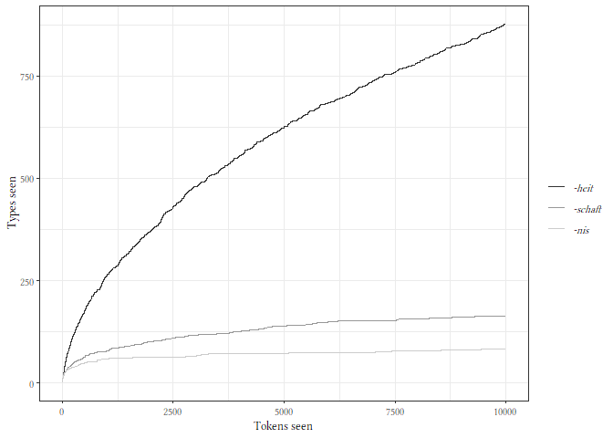

    ggsave('imgs/vgc.pdf', device=cairo_pdf, width=12, height=6, units = 'cm')

Pseudo-bootstrapping à la BaroniEvert2016 (sampling without replacement)
========================================================================

Type count
----------

    types_summ <- freqdist_iter %>% 
      group_by(suffix, sample_size, iter) %>% 
      summarise(n_types = n()) %>% 
      group_by(suffix, sample_size) %>%
      summarise(
        mean_n_types = mean(n_types),
        min = min(n_types),
        max = max(n_types))

    p_ntypes <- types_summ %>% 
      ggplot(aes(x=sample_size, y=mean_n_types, colour=suffix)) +
      geom_point()  +
      geom_line() +
      geom_errorbar(aes(ymin = min,
                        ymax = max),
                    alpha = 0.5,
                    width = 0.05) +
      labs(y = 'Count',
           x = 'Sample size (tokens)',
           title = 'Type count',
           colour = element_blank()) +
      scale_x_continuous(trans = 'log10') +
      scale_y_continuous(trans = 'log10') +
      scale_colour_grey() + 
      theme(plot.margin = unit(c(1,1,1,1), "lines")) +
      NULL

Potential productivity
----------------------

    pp_summ <- freqdist_iter %>% 
      filter(n_tokens == 1) %>%
      group_by(suffix, iter, sample_size) %>%
      summarise(n_hapaxes = sum(n_tokens)) %>% 
      mutate(pp = n_hapaxes/sample_size) %>% 
      group_by(suffix, sample_size) %>%
      summarise(mean_pp = mean(pp),
                min = min(pp),
                max = max(pp))

    p_pp <- pp_summ %>% 
      ggplot(aes(x=sample_size, y=mean_pp, colour=suffix)) +
      geom_point()  +
      geom_line() +
      geom_errorbar(aes(ymin = min,
                        ymax = max),
                    alpha = 0.5,
                    width = 0.05) +
      labs(y = 'Potential productivity',
           x = 'Sample size (tokens)',
           title = 'Potential productivity',
           colour = element_blank()) +
      ylim(c(0,1)) +
      scale_x_continuous(trans = 'log10') +
      scale_colour_grey() +
      theme(plot.margin = unit(c(1,1,1,1), "lines")) +
      NULL

S
-

    s_vec <- freqdist_iter %>% 
      group_by(suffix, iter, sample_size) %>% 
      group_map(~ get_fZM_S(.x)) %>% 
      unlist()

    # Get a df of the grouping variables as they were used for group_map()
    # and add the resulting vector as a column. Should match.
    s_iter <- freqdist_iter_wrepl %>% 
      select(suffix, iter, sample_size) %>% 
      distinct()
    s_iter$s <- s_vec

    write.csv(s_iter, 'iterdata/s_iter500.csv', row.names=FALSE)

    s_iter <- read.csv('iterdata/s_iter500.csv')
    levels(s_iter$suffix) <- c('-heit', '-nis', '-schaft')
    s_iter$suffix <- factor(s_iter$suffix, levels = c('-heit', '-schaft', '-nis'))

    # Remove outliers as above.
    s_wide <- s_iter %>% 
      pivot_wider(values_from = s, names_from = sample_size)

    # Rows 1:50 are -heit, 51:100 are -nis, 101:150 are -schaft.
    # Cols 3:17 are the fifteen different sample sizes.
    no_outl_wide <- rbind(
      as.data.frame(lapply(s_wide[1:50, 3:17], remove_outliers)),
      as.data.frame(lapply(s_wide[51:100, 3:17], remove_outliers)),
      as.data.frame(lapply(s_wide[101:150, 3:17], remove_outliers))
    )

    no_outl_iter <- cbind(s_wide[1:2], no_outl_wide) %>% 
      pivot_longer(cols = starts_with('X'), values_to = 's', names_to = 'sample_size') %>% 
      mutate(sample_size = as.numeric(gsub('X', '', sample_size)))

    # Now we can compute the mean and range for the remaining, non-outlier values.
    s_summ <- no_outl_iter %>%
      group_by(suffix, sample_size) %>%
      summarise(
        mean_s = mean(s, na.rm=TRUE),
        min = min(s, na.rm=TRUE),
        max = max(s, na.rm=TRUE))

### S plot

    p_s <- s_summ %>% 
      ggplot(aes(x=sample_size, y=mean_s, colour=suffix)) +
      geom_point()  +
      geom_line() +
      geom_errorbar(aes(ymin = min,
                        ymax = max),
                    alpha = 0.5,
                    width = 0.05) +
      labs(y = 'S',
           x = 'Sample size (tokens)',
           colour = element_blank(),
           title = 'S') +
      scale_x_continuous(trans = 'log10') +
      scale_y_continuous(trans = 'log10') +
      scale_colour_grey() +
      theme(plot.margin = unit(c(1,1,1,1), "lines"),
            axis.title.y = element_text(face = "italic"),
            plot.title = element_text(face = "italic")) +
      NULL

Entropy
-------

    # Compute entropy for each sample.
    ent_col <- freqdist_iter %>% 
      group_by(suffix, iter, sample_size) %>% 
      group_map(~entropy.empirical(.x$n_tokens, unit='log2')) %>% 
      unlist()

    # Get a df of the grouping variables as they were used for group_map(),
    # reorder -nis and -schaft so that they match the factor levels,
    # and add the resulting vector as a column.
    ent_iter <- freqdist_iter %>% 
      select(suffix, iter, sample_size) %>% 
      distinct()
    ent_iter <- rbind(
      ent_iter[1:7500,],      # heit
      ent_iter[15001:22500,], # schaft
      ent_iter[7501:15000,]   # nis
    )
    ent_iter$ent <- ent_col

    ent_summ <- ent_iter %>% 
      group_by(suffix, sample_size) %>% 
      summarise(
        mean_ent = mean(ent),
        min = min(ent),
        max = max(ent)
      )

    ent_summ %>%   
      ggplot(aes(x=sample_size, y=mean_ent, colour=suffix)) +
      geom_point()  +
      geom_line() +
      geom_errorbar(aes(ymin = min,
                        ymax = max),
                    alpha = 0.5,
                    width = 0.05) +
      labs(y = 'Shannon entropy',
           x = 'Sample size (tokens)',
           colour = 'Suffix') +
      scale_x_continuous(trans = 'log10') +
      scale_colour_grey() +
      NULL

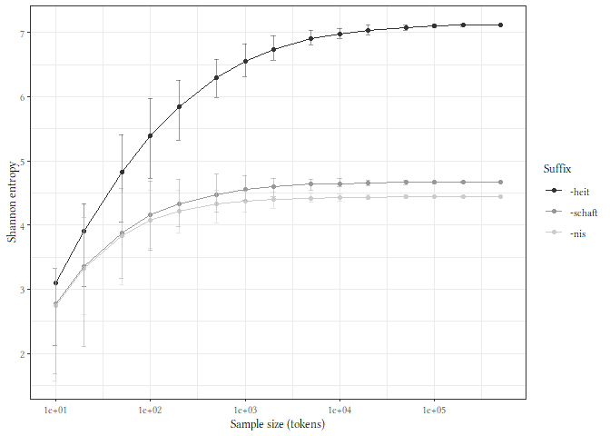

Contrast the replacement methods
================================

Type count
----------

    types_summ_both <- bind_rows(list(`With repl.` = types_summ_wrepl, `Without repl.` = types_summ), .id = 'repl')

    (p_ntypes_samp <- types_summ_both %>% 
        ggplot(aes(x=sample_size, y=mean_n_types, colour=suffix, linetype=repl, shape=repl)) +
        geom_point()  +
        geom_line() +
        geom_errorbar(aes(ymin = min,
                          ymax = max),
                      alpha = 0.5,
                      width = 0.1) +
        labs(y = 'Count',
             x = 'Sample size (tokens)',
             colour = element_blank(),
             linetype = element_blank(),
             shape = element_blank()) +
        scale_x_continuous(trans = 'log10') +
        scale_y_continuous(trans = 'log10') +
        scale_colour_grey(guide = guide_legend(order=1, 
                                               label.theme = element_text(face = "italic", 
                                                                          family = "Linux Libertine Display G",
                                                                          size = 8))) + 
        NULL)

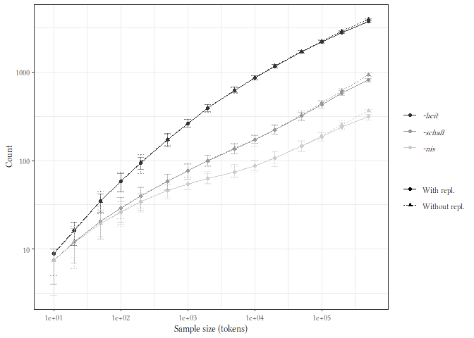

    ggsave('imgs/boot-typecount.pdf', device=cairo_pdf, width=14, height=10, units='cm')

Potential productivity
----------------------

    pp_summ_both <- bind_rows(list(`With repl.` = pp_summ_wrepl, `Without repl.` = pp_summ), .id = 'repl')

    (p_pp_samp <- pp_summ_both %>% 
        ggplot(aes(x=sample_size, y=mean_pp, colour=suffix, linetype=repl, shape=repl)) +
        geom_point()  +
        geom_line() +
        geom_errorbar(aes(ymin = min,
                          ymax = max),
                      alpha = 0.5,
                      width = 0.1) +
        labs(y = 'Potential productivity',
             x = 'Sample size (tokens)',
             colour = element_blank(),
             linetype = element_blank(),
             shape = element_blank()) +
        scale_x_continuous(trans = 'log10') +
        scale_colour_grey(guide = guide_legend(order=1, 
                                               label.theme = element_text(face = "italic", 
                                                                          family = "Linux Libertine Display G",
                                                                          size = 8))) + 
        NULL)

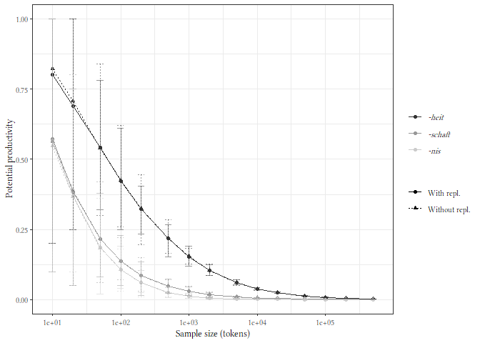

    ggsave('imgs/boot-pp.pdf', device=cairo_pdf, width=14, height=10, units='cm')

S
-

    s_summ_both <- bind_rows(list(`With repl.` = s_summ_wrepl, `Without repl.` = s_summ), .id = 'repl')

    (p_s_samp <- s_summ_both %>% 
        ggplot(aes(x=sample_size, y=mean_s, colour=suffix, linetype=repl, shape=repl)) +
        geom_point()  +
        geom_line() +
        geom_errorbar(aes(ymin = min,
                          ymax = max),
                      alpha = 0.5,
                      width = 0.1) +
        labs(y = 'S',
             x = 'Sample size (tokens)',
             colour = element_blank(),
             linetype = element_blank(),
             shape = element_blank()) + 
        scale_x_continuous(trans = 'log10') +
        scale_y_continuous(trans = 'log10',
                           labels = function(x) format(x, scientific = TRUE)) +
        scale_colour_grey(guide = guide_legend(order=1, 
                                               label.theme = element_text(face = "italic", 
                                                                          family = "Linux Libertine Display G",
                                                                          size = 8))) + 
       theme(axis.title.y = element_text(face = "italic")) +
        NULL)

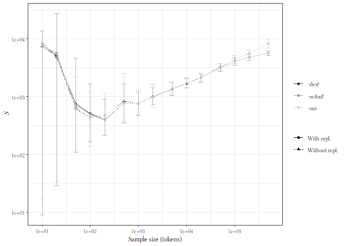

    ggsave('imgs/boot-s.pdf', device=cairo_pdf, width=14, height=10, units='cm')

Entropy
-------

    ent_summ_both <- bind_rows(list(`With repl.` = ent_summ_wrepl, `Without repl.` = ent_summ), .id = 'repl')

    (p_ent_samp <- ent_summ_both %>% 
        ggplot(aes(x=sample_size, y=mean_ent, colour=suffix, linetype=repl, shape=repl)) +
        geom_point()  +
        geom_line() +
        geom_errorbar(aes(ymin = min,
                          ymax = max),
                      alpha = 0.5,
                      width = 0.1) +
        labs(y = 'Shannon entropy',
             x = 'Sample size (tokens)',
             colour = element_blank(),
             linetype = element_blank(),
             shape = element_blank()) +
        scale_x_continuous(trans = 'log10') +
        scale_colour_grey(guide = guide_legend(order=1, 
                                               label.theme = element_text(face = "italic", 
                                                                          family = "Linux Libertine Display G",
                                                                          size = 8))) + 
        NULL)

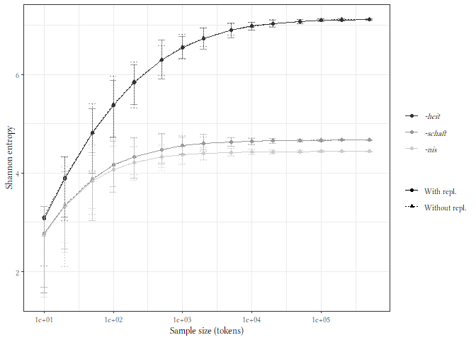

    ggsave('imgs/boot-entropy.pdf', device=cairo_pdf, width=14, height=10, units='cm')

R session info
==============

    sessionInfo()

    ## R version 3.6.1 (2019-07-05)
    ## Platform: x86_64-w64-mingw32/x64 (64-bit)
    ## Running under: Windows 10 x64 (build 19043)
    ## 
    ## Matrix products: default
    ## 
    ## locale:
    ## [1] LC_COLLATE=English_Canada.1252  LC_CTYPE=English_Canada.1252   
    ## [3] LC_MONETARY=English_Canada.1252 LC_NUMERIC=C                   
    ## [5] LC_TIME=English_Canada.1252    
    ## 
    ## attached base packages:
    ## [1] stats     graphics  grDevices utils     datasets  methods   base     
    ## 
    ## other attached packages:
    ##  [1] extrafont_0.17  patchwork_1.1.1 ggpubr_0.4.0    entropy_1.3.0  
    ##  [5] forcats_0.5.1   stringr_1.4.0   dplyr_1.0.5     purrr_0.3.4    
    ##  [9] readr_1.4.0     tidyr_1.1.3     tibble_3.1.0    ggplot2_3.3.3  
    ## [13] tidyverse_1.3.0
    ## 
    ## loaded via a namespace (and not attached):
    ##  [1] Rcpp_1.0.6        lubridate_1.7.10  assertthat_0.2.1  digest_0.6.27    
    ##  [5] utf8_1.2.1        R6_2.5.0          cellranger_1.1.0  backports_1.2.1  
    ##  [9] reprex_2.0.0      evaluate_0.14     highr_0.8         httr_1.4.2       
    ## [13] pillar_1.5.1      rlang_0.4.10      curl_4.3          readxl_1.3.1     
    ## [17] rstudioapi_0.13   data.table_1.14.0 extrafontdb_1.0   car_3.0-10       
    ## [21] rmarkdown_2.7     labeling_0.4.2    foreign_0.8-71    munsell_0.5.0    
    ## [25] broom_0.7.6       compiler_3.6.1    modelr_0.1.8      xfun_0.22        
    ## [29] pkgconfig_2.0.3   htmltools_0.5.1.1 tidyselect_1.1.0  rio_0.5.26       
    ## [33] fansi_0.4.2       crayon_1.4.1      dbplyr_2.1.1      withr_2.4.1      
    ## [37] grid_3.6.1        Rttf2pt1_1.3.8    jsonlite_1.7.2    gtable_0.3.0     
    ## [41] lifecycle_1.0.0   DBI_1.1.1         magrittr_2.0.1    scales_1.1.1     
    ## [45] zip_2.1.1         carData_3.0-4     cli_2.4.0         stringi_1.5.3    
    ## [49] farver_2.1.0      ggsignif_0.6.1    fs_1.5.0          xml2_1.3.2       
    ## [53] ellipsis_0.3.1    generics_0.1.0    vctrs_0.3.7       openxlsx_4.2.3   
    ## [57] tools_3.6.1       glue_1.4.2        hms_1.0.0         abind_1.4-5      
    ## [61] yaml_2.2.1        colorspace_2.0-0  rstatix_0.7.0     rvest_1.0.0      
    ## [65] knitr_1.31        haven_2.3.1
