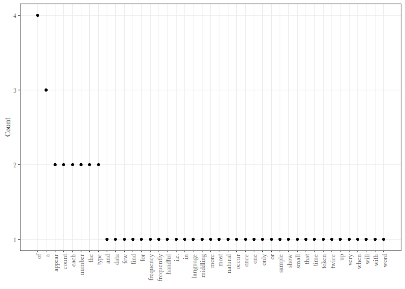
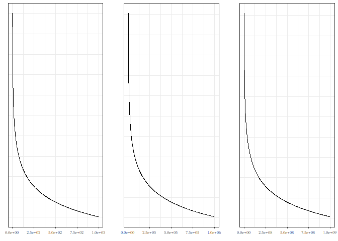

    library(tidyverse)
    library(ggpubr)
    library(ggforce)
    library(extrafont)
    loadfonts()

    theme_set(theme_bw(base_size = 10))
    theme_update(text = element_text(family = "Linux Libertine Display G"))

Figure 1: Example type frequency distribution
=============================================

    sent <- "When counting the number of times each word appears in a sample of natural language data (i.e., counting the number of tokens for each type), one will find that a small handful of types occur very frequently, a few more appear with middling frequency, and most show up only once or twice"
    sent_lemma <- "when count the number of time each word appear in a sample of natural language data i.e. count the number of token for each type one will find that a small handful of type occur very frequently a few more appear with middling frequency and most show up only once or twice"

    tok_freq <- as.data.frame(table(strsplit(sent_lemma, ' '))) %>% 
      arrange(desc(Freq)) %>% 
      mutate(rank = row_number())

    tok_freq %>% 
      ggplot(aes(x = rank, y = Freq)) +
      geom_point() +
      scale_x_continuous(breaks = 1:nrow(tok_freq), 
                         labels = tok_freq$Var1) +
      theme(panel.grid.minor = element_blank(),
            axis.text.x = element_text(angle = 90, hjust=1, vjust=0.5)) +
      labs(y = 'Count',
           x = element_blank()) +
      NULL

    ggsave('imgs/freqdist.pdf', device=cairo_pdf, width=12, height=6, units='cm')

Figure 2: Scale-free Zipf
=========================

    len_sec <- 1e3

    zipfdat <- tibble(
      scale = c(rep(1, len_sec), rep(2, len_sec), rep(3, len_sec)),
      rank = c(seq(1, len_sec), seq(len_sec, len_sec^2, length.out = len_sec), seq(len_sec^2, len_sec^3, length.out = len_sec))
    )

    zipfdat %>% 
      mutate(freq = 1 / (rank^0.1)) %>% 
      ggplot(aes(x=rank, y=freq)) +
      facet_wrap(~scale, scales='free') +
      geom_line() +
      theme(strip.background = element_blank(),
            strip.text.x = element_blank(),
            axis.ticks.y = element_blank(),
            axis.text.y = element_blank(),
            axis.text = element_text(size=7),
            panel.spacing = unit(2, "lines")) +
      scale_x_continuous(labels = function(x) format(x, scientific = TRUE)) +
      labs(y = element_blank(),
           x = element_blank()) +
      NULL

    ggsave('imgs/zipf-selfsimil.pdf', device=cairo_pdf, width=15, height=5, units='cm')
