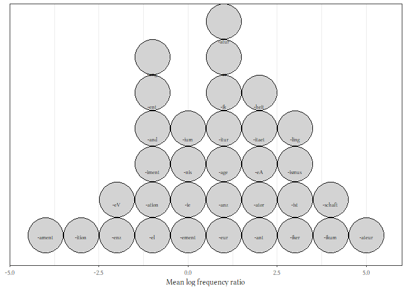
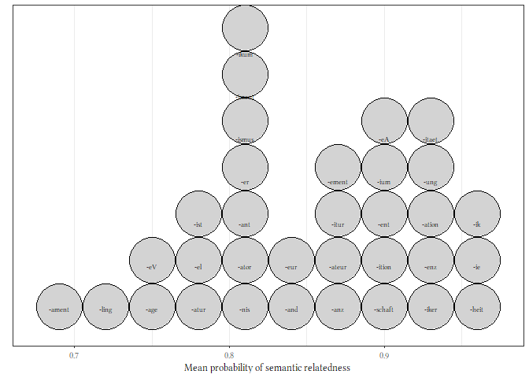
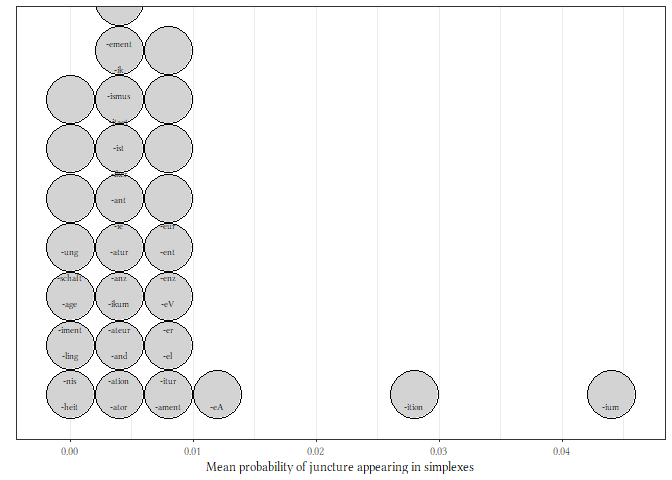
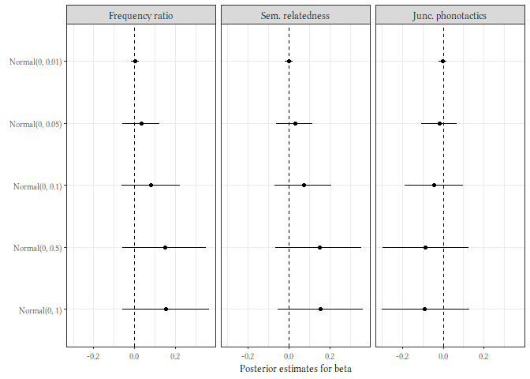
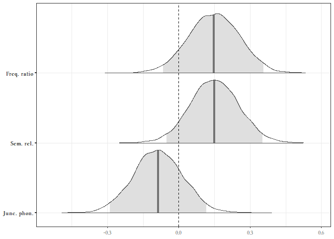
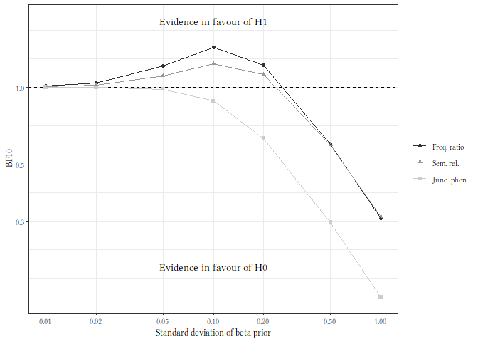

    library(tidyverse)
    library(GGally)
    library(brms)
    library(rstanarm)
    library(bayesplot)
    library(purrr)
    library(extrafont)
    library(ggsci)
    library(ggpubr)
    loadfonts()

    # Set working directory to location of current file.
    setwd(dirname(rstudioapi::getActiveDocumentContext()$path))

    # Suppress dplyr summarise warning.
    options(dplyr.summarise.inform = FALSE)
    theme_set(theme_bw(base_size = 10))
    theme_update(text = element_text(family = "Linux Libertine Display G"))

    # Read in data, and drop the two rows that have no semrel value (-end and -iteur)
    dat <- read.csv('../variables/sfx_data.csv') %>%
      drop_na()

    # Standardise predictors to z-scores
    dat <- dat %>% 
      mutate(z_jp = (mean_junc_prob - mean(mean_junc_prob)) / sd(mean_junc_prob),
             z_fr = (mean_log_freq_ratio - mean(mean_log_freq_ratio)) / sd(mean_log_freq_ratio),
             z_sm = (semrel_prob - mean(semrel_prob)) / sd(semrel_prob))

Visualise variables
===================

Plots of the variables on their original scales.

Dotplots with labels overlaid based on code here:
<a href="https://stackoverflow.com/questions/44991607/how-do-i-label-the-dots-of-a-geom-dotplot-in-ggplot2/45001849#45001849" class="uri">https://stackoverflow.com/questions/44991607/how-do-i-label-the-dots-of-a-geom-dotplot-in-ggplot2/45001849#45001849</a>

Frequency ratio
---------------

    dotwidth <- 1

    p_fr <- dat %>% 
      ggplot(aes(x=mean_log_freq_ratio)) +
      geom_dotplot(method='histodot',
                   binwidth = dotwidth) +
       NULL

    # Get y-positions of points plotted by geom_dotplot
    # Warning: these positions are not given
    point.pos <- ggplot_build(p_fr)$data[[1]]

    # Order rows of mtcars by hp
    idx <- order(dat$mean_log_freq_ratio)
    dat2 <- dat[idx,]

    # scale.fact needs fine tuning 
    # It is strictly connected to the dimensions of the plot
    scale.fact <- 0.1375
    dat2$ytext <- point.pos$stackpos*scale.fact
    dat2$xtext <- point.pos$x
    lbls <- gsub(" ","\n",dat2$sfx)

    ggplot(dat2, aes(mean_log_freq_ratio)) +
      geom_dotplot(method='histodot',
                   fill="lightgrey",
                   binwidth = dotwidth) +
      geom_text(aes(label=lbls, x=xtext, y=ytext), 
                family = "Linux Libertine Display G",
                size = 2.5) +
      theme(axis.ticks.y = element_blank(), 
            axis.text.y = element_blank(),
            panel.grid.major.y = element_blank(),
            panel.grid.minor.y = element_blank()) +
      labs(x = 'Mean log frequency ratio',
           y = element_blank())

    ggsave('imgs/fr.pdf', device=cairo_pdf, width=10, height=8, units='cm')

Semantic relatedness
--------------------

    dotwidth <- 0.03

    p <- dat %>% 
      ggplot(aes(x=semrel_prob)) +
      geom_dotplot(method='histodot',
                   binwidth = dotwidth) +
       NULL

    # Get y-positions of points plotted by geom_dotplot
    # Warning: these positions are not given
    point.pos <- ggplot_build(p)$data[[1]]

    # Order rows of mtcars by hp
    idx <- order(dat$semrel_prob)
    dat2 <- dat[idx,]

    # scale.fact needs fine tuning 
    # It is strictly connected to the dimensions of the plot
    scale.fact <- 0.1375
    dat2$ytext <- point.pos$stackpos*scale.fact
    dat2$xtext <- point.pos$x
    lbls <- gsub(" ","\n",dat2$sfx)

    ggplot(dat2, aes(semrel_prob)) +
      geom_dotplot(method='histodot',
                   fill="lightgrey",
                   binwidth = dotwidth) +
      geom_text(aes(label=lbls, x=xtext, y=ytext), 
                family = "Linux Libertine Display G",
                size = 2.5) +
      theme(axis.ticks.y = element_blank(), 
            axis.text.y = element_blank(),
            panel.grid.major.y = element_blank(),
            panel.grid.minor.y = element_blank()) +
      labs(x = 'Mean probability of semantic relatedness',
           y = element_blank())

    ggsave('imgs/sm.pdf', device=cairo_pdf, width=10, height=8, units='cm')

Junctural phonotactics
----------------------

    dotwidth <- 0.004

    p <- dat %>% 
      ggplot(aes(x=mean_junc_prob)) +
      geom_dotplot(method='histodot',
                   binwidth = dotwidth) +
       NULL

    # Get y-positions of points plotted by geom_dotplot
    # Warning: these positions are not given
    point.pos <- ggplot_build(p)$data[[1]]

    # Order rows of mtcars by hp
    idx <- order(dat$mean_junc_prob)
    dat2 <- dat[idx,]

    # scale.fact needs fine tuning 
    # It is strictly connected to the dimensions of the plot
    scale.fact <- 0.066
    dat2$ytext <- point.pos$stackpos*scale.fact
    dat2$xtext <- point.pos$x
    lbls <- gsub(" ","\n",dat2$sfx)

    ggplot(dat2, aes(mean_junc_prob)) +
      geom_dotplot(method='histodot',
                   fill="lightgrey",
                   binwidth = dotwidth) +
      geom_text(aes(label=lbls, x=xtext, y=ytext), 
                family = "Linux Libertine Display G",
                size = 2.3) +
      theme(axis.ticks.y = element_blank(), 
            axis.text.y = element_blank(),
            panel.grid.major.y = element_blank(),
            panel.grid.minor.y = element_blank()) +
      labs(x = 'Mean probability of juncture appearing in simplexes',
           y = element_blank())

    ggsave('imgs/jp.pdf', device=cairo_pdf, width=10, height=13, units='cm')

Pairs plot of z-scores
----------------------

    dat %>% 
      select(z_fr, z_sm, z_jp) %>% 
      rename('Frequency ratio\n(z-score)' = 'z_fr',
             'Sem. relatedness\n(z-score)' = 'z_sm',
             'Junc. phonotactics\n(z-score)' = 'z_jp') %>% 
      ggpairs(
        upper = list(combo = wrap('box_no_facet'),  # removes the box around the Corr cells in upper triangle
                     continuous = wrap('cor', family='Linux Libertine Display G'))  # no clue how, but can access font this way
      ) +
      theme(strip.text.x = element_text(size=10),
            strip.text.y = element_text(size=10))

    ggsave('imgs/pairs.pdf', device=cairo_pdf, width=12, height=12, units='cm')

Lognormal entropy
=================

How well does a lognormal distribution approximate the distribution we
observe for entropy?

If *y* is log-normally distributed, then that means that log (*y*) is
normally distributed.

    log_ent_mu <- mean(log(dat$entropy))
    log_ent_sigma <- sd(log(dat$entropy))

    dat %>% 
      ggplot(aes(x=log(entropy))) +
      geom_density(fill = 'red', colour='red', alpha=0.1) +
      stat_function(fun = dnorm, 
                    n=101, 
                    args = (list(mean=log_ent_mu, sd = log_ent_sigma)),
                    colour = 'blue', size=1) +
      annotate(geom='text', x = 0.5, y = 0.6, label='Lognormal\napproximation', colour='blue') +
      annotate(geom='text', x = 1.5, y = 0.2, label='Entropy of\ntype frequency\ndistributions', colour='red') +
      NULL

Prior prediction
================

    fit_prior <- brm(entropy ~ z_jp + z_fr + z_sm,
      data = dat,
      family = lognormal(),
      prior = c(
        prior(normal(1, 0.5), class = Intercept),
        prior(normal(0, 0.3), class = sigma),
        prior(normal(0, 0.5), class = b)
      ),
      sample_prior = "only",
      iter = 3000
    )

    save(file='model_prior_pred.rda', fit_prior)

    load('model_prior_pred.rda')
    color_scheme_set('gray')
    pp_check(fit_prior, type='boxplot', notch=FALSE, nsamples = 10, seed=1) +
      labs(y='Shannon entropy (bits)')
    ggsave('imgs/ppcheck.pdf', device=cairo_pdf, width=12, height=6, units='cm')

Sensitivity analysis
====================

    sds <- c(0.01, 0.05, 0.1, 0.5, 1)

    sens_ana <- map_dfr(sds, function(sd){
      priorb <- paste0('normal(0, ', sd, ')')
      fit <- brm(entropy ~ z_jp + z_fr + z_sm,
                 data = dat,
                 family = lognormal(),
                 prior = c(
                   prior(normal(1, 0.5), class = Intercept),
                   prior(normal(0, 0.3), class = sigma),
                   prior_string(priorb, class = 'b')
                 ),
                 iter = 3000)
      posterior_summary(fit, pars = c('b_z_jp', 'b_z_fr', 'b_z_sm')) %>% 
        as_tibble(rownames=NA) %>% 
        rownames_to_column(var='param') %>% 
        mutate(prior = priorb)
    })

    write.csv(sens_ana, 'sens_ana.csv', row.names=FALSE)

    sens_ana <- read.csv('sens_ana.csv')

    # Spell out and reorder variable names
    levels(sens_ana$param) <- c('Frequency ratio', 'Junc. phonotactics', 'Sem. relatedness')
    sens_ana$param <- factor(sens_ana$param, levels=c('Frequency ratio', 'Sem. relatedness', 'Junc. phonotactics'))

    sens_ana$prior <- factor(sens_ana$prior, levels=rev(levels(sens_ana$prior)))  # Reverse order of factors

    sens_ana %>% 
      ggplot(aes(x=prior, y=Estimate)) +
      geom_point() +
      geom_linerange(aes(ymin=Q2.5, ymax=Q97.5)) +
      facet_wrap(~param) +
      coord_flip() +
      geom_hline(yintercept=0, linetype='dashed') +
      labs(x = element_blank(),
           y = 'Posterior estimates for beta') +
      theme(strip.text.x = element_text(size=10)) +
      NULL

    ggsave('imgs/sens.pdf', device=cairo_pdf, width=14, height=8, units='cm')

Estimation
==========

    fit <- brm(entropy ~ z_jp + z_fr + z_sm,
      data = dat,
      family = lognormal(),
      prior = c(
        prior(normal(1, 0.5), class = Intercept),
        prior(normal(0, 0.3), class = sigma),
        prior(normal(0, 0.5), class = b)
      ),
      iter = 3000
    )

    summary(fit)

    # pp_check(fit, type='boxplot', notch=FALSE, nsamples = 20)
    save(file = 'model_fit.rda', fit)

    load('model_fit.rda')

    summary(fit)

    ##  Family: lognormal 
    ##   Links: mu = identity; sigma = identity 
    ## Formula: entropy ~ z_jp + z_fr + z_sm 
    ##    Data: dat (Number of observations: 33) 
    ## Samples: 4 chains, each with iter = 3000; warmup = 1500; thin = 1;
    ##          total post-warmup samples = 6000
    ## 
    ## Population-Level Effects: 
    ##           Estimate Est.Error l-95% CI u-95% CI Rhat Bulk_ESS Tail_ESS
    ## Intercept     1.21      0.10     1.01     1.40 1.00     7217     4166
    ## z_jp         -0.09      0.10    -0.29     0.12 1.00     7517     4749
    ## z_fr          0.15      0.11    -0.07     0.36 1.00     6660     4575
    ## z_sm          0.15      0.10    -0.05     0.35 1.00     6859     4390
    ## 
    ## Family Specific Parameters: 
    ##       Estimate Est.Error l-95% CI u-95% CI Rhat Bulk_ESS Tail_ESS
    ## sigma     0.58      0.07     0.46     0.73 1.00     6028     4462
    ## 
    ## Samples were drawn using sampling(NUTS). For each parameter, Bulk_ESS
    ## and Tail_ESS are effective sample size measures, and Rhat is the potential
    ## scale reduction factor on split chains (at convergence, Rhat = 1).

    color_scheme_set('gray')
    mcmc_areas(fit, 
               pars = c('b_z_jp', 'b_z_fr', 'b_z_sm'),
               prob = .95,
               point_est='mean') +
      geom_vline(xintercept=0, linetype='dashed') +
      scale_y_discrete(labels = c('b_z_jp' = 'Junc. phon.',
                                'b_z_fr' = 'Freq. ratio',
                                'b_z_sm' = 'Sem. rel.'),
                       limits = c('b_z_jp', 'b_z_sm', 'b_z_fr')) +
      coord_cartesian(ylim = c(1.4, 3.4)) +   # hack to move axis ticks down
      NULL

    ggsave('imgs/beta-pstr.pdf', device=cairo_pdf, width=12, height=8, units='cm')

Transforming LM estimates back to original (SD) scale
=====================================================

The above estimates are on the log scale.

For an interpretation of each of these effects in SDs, let us take for
each parameter the difference in entropy between that parameter at its
mean and at 1 SD below the mean, holding the other parameters at their
means of zero (accomplished by leaving them out of the eq).

    int_samples <- posterior_samples(fit)$b_Intercept
    b_z_jp_samples <- posterior_samples(fit)$b_z_jp
    b_z_fr_samples <- posterior_samples(fit)$b_z_fr
    b_z_sm_samples <- posterior_samples(fit)$b_z_sm

    # JP
    eff_jp_samples <- exp(int_samples) - exp(int_samples - b_z_jp_samples)
    eff_jp <- c(mean = mean(eff_jp_samples), quantile(eff_jp_samples, c(.025, .975)))

    # FR
    eff_fr_samples <- exp(int_samples) - exp(int_samples - b_z_fr_samples)
    eff_fr <- c(mean = mean(eff_fr_samples), quantile(eff_fr_samples, c(.025, .975)))

    # SM
    eff_sm_samples <- exp(int_samples) - exp(int_samples - b_z_sm_samples)
    eff_sm <- c(mean = mean(eff_sm_samples), quantile(eff_sm_samples, c(.025, .975)))

    bind_rows(list('Junc. phonotactics' = eff_jp, 'Freq. ratio' = eff_fr, 'Sem. relatedness' = eff_sm), .id = 'Factor')

    ## # A tibble: 3 x 4
    ##   Factor               mean `2.5%` `97.5%`
    ##   <chr>               <dbl>  <dbl>   <dbl>
    ## 1 Junc. phonotactics -0.326 -1.15    0.366
    ## 2 Freq. ratio         0.446 -0.224   1.04 
    ## 3 Sem. relatedness    0.453 -0.168   1.02

    bind_rows(list('Junc. phonotactics' = eff_jp, 'Freq. ratio' = eff_fr, 'Sem. relatedness' = eff_sm), .id = 'Factor') %>% 
      xtable::xtable()

    ## % latex table generated in R 3.6.1 by xtable 1.8-4 package
    ## % Mon Aug 02 10:32:26 2021
    ## \begin{table}[ht]
    ## \centering
    ## \begin{tabular}{rlrrr}
    ##   \hline
    ##  & Factor & mean & 2.5\% & 97.5\% \\ 
    ##   \hline
    ## 1 & Junc. phonotactics & -0.33 & -1.15 & 0.37 \\ 
    ##   2 & Freq. ratio & 0.45 & -0.22 & 1.04 \\ 
    ##   3 & Sem. relatedness & 0.45 & -0.17 & 1.02 \\ 
    ##    \hline
    ## \end{tabular}
    ## \end{table}

This means that, for example, an increase of one SD in junctural
phonotactics near the middle of the range of that predictor will result
in a decrease in entropy of -0.33 bits on average. For frequency ratio,
an increase of one SD will lead to an increase of 0.45 bits of entropy
on average. For semantic relatedness, one SD increase will lead to an
increase in entropy of 0.45 bits on average. In all of these cases,
though, zero is included within the 95% credible interval.

Bayes factors: SA with empirical data
=====================================

Caveat: This code could look way nicer if R didn’t keep crashing.

All of the H1 models are the same; they all contain all three
predictors. The H0 models have each predictor left out once. So we can
fit all the H1 models up front and use them below (a) for computing the
empirical Bayes factor and (b) for posterior simulation to check the
behaviour of BFs.

H1 models
---------

    prior_sd <- c(0.01, 0.02, 0.05, 0.1, 0.2, 0.5, 1)

    for(psd in prior_sd){
      beta_prior <- paste0('normal(0,',psd,')')
      
      # Fit H1 model (all three predictors)
      h1 <- brm(entropy ~ z_jp + z_fr + z_sm,
                data = dat,
                family = lognormal(),
                prior = c(
                  prior(normal(1, 0.5), class = Intercept),
                  prior(normal(0, 0.3), class = sigma),
                  set_prior(beta_prior, class = 'b')
                ),
                warmup = 2000,
                iter = 10000,
                cores = 1,
                save_pars = save_pars(all = TRUE))
      save(h1, file = paste0('bf_fits/emp_h1/psd', psd, '.rda'))
    }

Now we look at the three factors one by one.

Freq ratio
----------

Fit models using each prior SD and save to `.rda`. (The for loop
structure somehow helps R crash less.)

    for(psd in prior_sd){
      beta_prior <- paste0('normal(0,',psd,')')
      
      # Fit H0 model (freq ratio left out)
      h0 <- brm(entropy ~ z_jp + z_sm,
                data = dat,
                family = lognormal(),
                prior = c(
                  prior(normal(1, 0.5), class = Intercept),
                  prior(normal(0, 0.3), class = sigma),
                  set_prior(beta_prior, class = 'b')
                ),
                warmup = 2000,
                iter = 10000,
                cores = 1,
                save_pars = save_pars(all = TRUE))
      save(h0, file = paste0('bf_fits/fr_emp_h0/psd', psd, '.rda'))
    }

    # nb: since they have the same names, will have to read in each one separately, compute bf,
    # and then read in the next one so first one doesn't get overwritten

Read in each `.rda` file and estimate the Bayes factor for those two
models using bridge sampling. (`cores = 1` everywhere in an attempt not
to avoid crashes.)

    fr_bfs_list <- list()

    for(psd in prior_sd){
      load(file = paste0('bf_fits/emp_h1/psd', psd, '.rda'))
      load(file = paste0('bf_fits/fr_emp_h0/psd', psd, '.rda'))

      lml_h1 <- bridge_sampler(h1, silent = TRUE, cores = 1)
      lml_h0 <- bridge_sampler(h0, silent = TRUE, cores = 1)

      fr_bfs_list[as.character(psd)] <- bayes_factor(lml_h1, lml_h0, cores=1)$bf
      
      message(paste('Done', psd))
    }

    rm(h0, h1, lml_h1, lml_h0)

    fr_bfs <- bind_rows(fr_bfs_list, .id=sd) %>% 
      pivot_longer(cols=everything(), names_to='SD', values_to='BF10') %>% 
      mutate(SD = as.numeric(gsub('X', '', SD)))

    write.csv(fr_bfs, 'bf_fits/fr_bfs_empirical.csv', row.names=FALSE)

    fr_bfs <- read.csv('bf_fits/fr_bfs_empirical.csv')
    fr_bfs %>% 
      ggplot(aes(x=SD, y=BF10)) +
      geom_point() +
      geom_line() +
      geom_hline(yintercept=1, linetype='dashed') +
      scale_x_continuous(trans='log10', breaks = prior_sd) +
      scale_y_continuous(trans='log10') +
      theme(panel.grid.minor.x = element_blank()) +
      NULL

Sem rel
-------

Fit models using each prior SD and save to `.rda`.

    for(psd in prior_sd){
      beta_prior <- paste0('normal(0,',psd,')')
      
      # Fit H0 model (semrel left out)
      h0 <- brm(entropy ~ z_jp + z_fr,
                data = dat,
                family = lognormal(),
                prior = c(
                  prior(normal(1, 0.5), class = Intercept),
                  prior(normal(0, 0.3), class = sigma),
                  set_prior(beta_prior, class = 'b')
                ),
                warmup = 2000,
                iter = 10000,
                cores = 1,
                save_pars = save_pars(all = TRUE))
      save(h0, file = paste0('bf_fits/sm_emp_h0/psd', psd, '.rda'))
    }

Read in each `.rda` file and estimate the Bayes factor for those two
models using bridge sampling.

    sm_bfs_list <- list()

    for(psd in prior_sd){
      load(file = paste0('bf_fits/emp_h1/psd', psd, '.rda'))
      load(file = paste0('bf_fits/sm_emp_h0/psd', psd, '.rda'))

      lml_h1 <- bridge_sampler(h1, silent = TRUE, cores = 1)
      lml_h0 <- bridge_sampler(h0, silent = TRUE, cores = 1)

      sm_bfs_list[as.character(psd)] <- bayes_factor(lml_h1, lml_h0, cores=1)$bf
      
      message(paste('Done', psd))
    }

    rm(h0, h1, lml_h1, lml_h0)

    sm_bfs <- bind_rows(sm_bfs_list, .id=sd) %>% 
      pivot_longer(cols=everything(), names_to='SD', values_to='BF10') %>% 
      mutate(SD = as.numeric(gsub('X', '', SD)))

    write.csv(sm_bfs, 'bf_fits/sm_bfs_empirical.csv', row.names=FALSE)

    sm_bfs <- read.csv('bf_fits/sm_bfs_empirical.csv')
    sm_bfs %>% 
      ggplot(aes(x=SD, y=BF10)) +
      geom_point() +
      geom_line() +
      geom_hline(yintercept=1, linetype='dashed') +
      scale_x_continuous(trans='log10', breaks = prior_sd) +
      theme(panel.grid.minor.x = element_blank()) +
      NULL

Junc prob
---------

Fit models using each prior SD and save to `.rda`.

    for(psd in prior_sd){
      beta_prior <- paste0('normal(0,',psd,')')
      
      # Fit H0 model (junc prob left out)
      h0 <- brm(entropy ~ z_sm + z_fr,
                data = dat,
                family = lognormal(),
                prior = c(
                  prior(normal(1, 0.5), class = Intercept),
                  prior(normal(0, 0.3), class = sigma),
                  set_prior(beta_prior, class = 'b')
                ),
                warmup = 2000,
                iter = 10000,
                cores = 1,
                save_pars = save_pars(all = TRUE))
      save(h0, file = paste0('bf_fits/jp_emp_h0/psd', psd, '.rda'))
    }

Read in each `.rda` file and estimate the Bayes factor for those two
models using bridge sampling.

    jp_bfs_list <- list()

    for(psd in prior_sd){
      load(file = paste0('bf_fits/emp_h1/psd', psd, '.rda'))
      load(file = paste0('bf_fits/jp_emp_h0/psd', psd, '.rda'))

      lml_h1 <- bridge_sampler(h1, silent = TRUE, cores = 1)
      lml_h0 <- bridge_sampler(h0, silent = TRUE, cores = 1)

      jp_bfs_list[as.character(psd)] <- bayes_factor(lml_h1, lml_h0, cores=1)$bf
      
      message(paste('Done', psd))
    }

    rm(h0, h1, lml_h1, lml_h0)

    jp_bfs <- bind_rows(jp_bfs_list, .id=sd) %>% 
      pivot_longer(cols=everything(), names_to='SD', values_to='BF10') %>% 
      mutate(SD = as.numeric(gsub('X', '', SD)))

    write.csv(jp_bfs, 'bf_fits/jp_bfs_empirical.csv', row.names=FALSE)

    jp_bfs <- read.csv('bf_fits/jp_bfs_empirical.csv')
    jp_bfs %>% 
      ggplot(aes(x=SD, y=BF10)) +
      geom_point() +
      geom_line() +
      geom_hline(yintercept=1, linetype='dashed') +
      scale_x_continuous(trans='log10', breaks = prior_sd) +
      theme(panel.grid.minor.x = element_blank()) +
      NULL

All plots
---------

    bfs <- bind_rows(
      list(`Freq. ratio` = fr_bfs,
           `Sem. rel.` = sm_bfs,
           `Junc. phon.` = jp_bfs),
      .id = 'Factor'
    )

    # Spell out and reorder variable names
    bfs$Factor <- as.factor(bfs$Factor)
    bfs$Factor <- factor(bfs$Factor, levels=c('Freq. ratio', 'Sem. rel.', 'Junc. phon.'))

    bfs %>% 
      ggplot(aes(x=SD, y=BF10, colour=Factor, shape=Factor)) +
      geom_hline(yintercept=1, linetype='dashed', size=0.3) +
      geom_point() +
      geom_line() +
      annotate(geom='text', family = "Linux Libertine Display G",
               label='Evidence in favour of H1', 
               y = 1.81, 
               x = .1) +
      annotate(geom='text', family = "Linux Libertine Display G",
               label='Evidence in favour of H0', 
               y = 0.2, 
               x = .1) +
      scale_x_continuous(trans='log10', breaks = prior_sd) +
      scale_y_continuous(trans='log10', limits = c(0.15, 1.85)) +
      theme(panel.grid.minor.x = element_blank()) +
      labs(colour = element_blank(),
           shape = element_blank(),
           x = 'Standard deviation of beta prior') +
      scale_color_grey() +
      NULL

    ggsave('imgs/bfs.pdf', device=cairo_pdf, width=12, height=8, units='cm')
