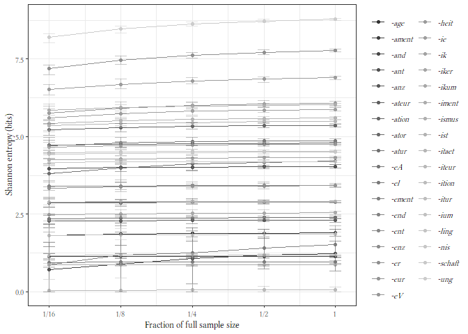
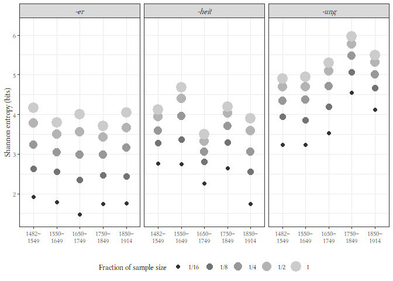
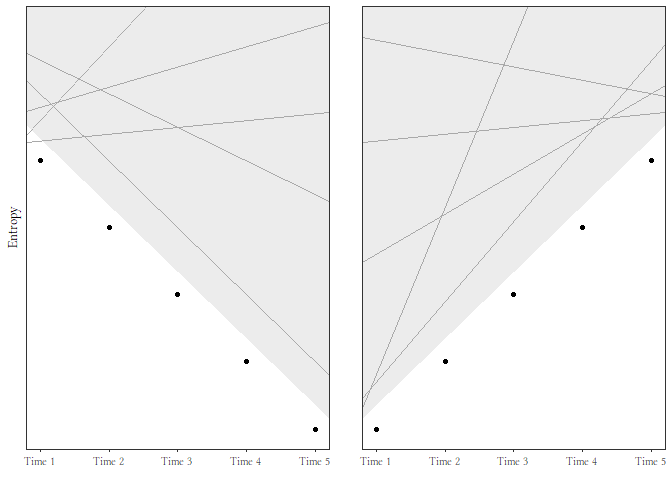

DECOW data (the 35 suffixes)
============================

    entropy_iter <- read.csv('iterdata/entropy_iter_wrepl.csv') 

    entropy_summ <- entropy_iter%>% 
      group_by(sfx, sample_size, factor) %>% 
      summarise(
        mean_entropy = mean(entropy),
        min_entropy = min(entropy),
        max_entropy = max(entropy))

    entropy_summ %>%   
      ggplot(aes(x=factor, y=mean_entropy, colour=sfx)) +
      geom_point()  +
      geom_line() +
      geom_errorbar(aes(ymin = min_entropy,
                        ymax = max_entropy),
                    alpha = 0.5,
                    width = 0.05) +
      labs(y = 'Shannon entropy (bits)',
           x = 'Fraction of full sample size',
           colour = element_blank()) +
      scale_x_continuous(trans = 'log10', 
                         breaks=unique(entropy_summ$factor),
                         labels = c('1/16', '1/8', '1/4', '1/2', '1')) +
      scale_colour_grey(guide = guide_legend(label.theme = element_text(face = "italic", 
                                                                        family = "Linux Libertine Display G",
                                                                        size = 8))) +
      NULL

How many suffixes have a mean entropy at a factor of 1 that’s not in the
interval at factor = 1/2?

    ent_not_in_range <- c()

    for(curr_sfx in unique(entropy_summ$sfx)){
      sfx_ent <- filter(entropy_summ, as.character(sfx) == curr_sfx) 
      f1_ent <- filter(sfx_ent, factor==1)$mean_entropy
      f0.5_min <- filter(sfx_ent, factor==0.5)$min_entropy
      f0.5_max <- filter(sfx_ent, factor==0.5)$max_entropy
      
      if((f1_ent > f0.5_max) | (f1_ent < f0.5_min)){
        ent_not_in_range <- c(ent_not_in_range, curr_sfx)
      }
    }

    ent_not_in_range

    ## NULL

RIDGES data
===========

    r_entropy_iter <- read.csv('iterdata/ridges_entropy_iter_wrepl.csv') 

    r_entropy_summ <- r_entropy_iter %>% 
      group_by(sfx, sample_size, factor, period) %>% 
      summarise(
        mean_entropy = mean(entropy),
        min_entropy = min(entropy),
        max_entropy = max(entropy))

    r_entropy_summ %>%
      mutate(sfx = plyr::revalue(sfx, c('er'='-er', 'heit'='-heit', 'ung'='-ung'))) %>% 
      ggplot(aes(x=period, y=mean_entropy, colour=as.factor(factor))) +
      facet_wrap(~sfx) +
      geom_point(aes(size=as.factor(factor)))  +
      labs(y = 'Shannon entropy (bits)',
           x = element_blank(),
           colour = 'Fraction of sample size',
           size = 'Fraction of sample size') +
      scale_color_grey(labels = c('1/16', '1/8', '1/4', '1/2', '1')) +
      scale_size_discrete(labels = c('1/16', '1/8', '1/4', '1/2', '1')) +
      scale_x_discrete(labels = gsub('-', '–\n', levels(r_entropy_summ$period))) +
      ylim(c(1.4, 6.2)) +
      theme(legend.position = 'bottom',
            strip.text = element_text(face = "italic",
                                      family = "Linux Libertine Display G",
                                      size = 10)) +
      NULL

    ggsave('imgs/ridges.pdf', device=cairo_pdf, width=15, height=8, units='cm')

Figure 15: Schematic trend lines for diachronic data
====================================================

    n_times <- 5

    trend <- tibble(
      trend = c(rep('desc', n_times), rep('asc', n_times)),
      time = rep(1:n_times, 2),
      entropy = c((n_times+1):2,  # decreasing over time
                  2:(n_times+1)) # increasing over time
    )

    # Rather than messing around with faceting (which would be possible, but I don't want to bother),
    # I'll create two separate plots and join them with ggarrange.

    asc_poly <- tibble(
      x = c(1, 5, 5, 1),
      y = c(2.75, 6.72, 8, 8)
    )

    asc <- trend %>% 
      filter(trend == 'asc') %>% 
      ggplot(aes(x=time, y=entropy)) +
      geom_shape(data = asc_poly, aes(x=x, y=y), fill='grey', alpha=0.3, expand=unit(0.5, 'cm')) +
      geom_point() +
      geom_abline(slope = 1.2, intercept = 1.5, colour='darkgrey') +
      geom_abline(slope = 0.6, intercept = 4, colour='darkgrey') +
      geom_abline(slope = 0.1, intercept = 6.2, colour='darkgrey') +
      geom_abline(slope = 2.5, intercept = 0.3, colour='darkgrey') +
      geom_abline(slope = -0.2, intercept = 8, colour='darkgrey') +
      scale_x_continuous(labels = c('Time 1', 'Time 2', 'Time 3', 'Time 4', 'Time 5')) +
      labs(x = element_blank(),
           y = ' ') +
      ylim(c(2, 8)) +
      theme(panel.grid = element_blank(),
            axis.text.y = element_blank(),
            axis.ticks.y = element_blank()) +
      NULL

    desc_poly <- tibble(
      x = c(1, 1, 5, 5),
      y = c(8, 6.72, 2.75, 8)
    )

    desc <- trend %>% 
      filter(trend == 'desc') %>% 
      ggplot(aes(x=time, y=entropy)) +
      geom_shape(data = desc_poly, aes(x=x, y=y), fill='grey', alpha=0.3, expand=unit(0.5, 'cm')) +
      geom_point() +
      geom_abline(slope = -1, intercept = 8, colour='darkgrey') +
      geom_abline(slope = -0.5, intercept = 8, colour='darkgrey') +
      geom_abline(slope = 0.1, intercept = 6.2, colour='darkgrey') +
      geom_abline(slope = 1.1, intercept = 5.5, colour='darkgrey') +
      geom_abline(slope = 0.3, intercept = 6.5, colour='darkgrey') +
      scale_x_continuous(labels = c('Time 1', 'Time 2', 'Time 3', 'Time 4', 'Time 5')) +
      labs(x = element_blank(),
           y = 'Entropy') +
      ylim(c(2, 8)) +
      theme(panel.grid = element_blank(),
            axis.text.y = element_blank(),
            axis.ticks.y = element_blank()) +
      NULL

    ggarrange(desc, asc, ncol=2)

    ggsave('imgs/trend.pdf', device=cairo_pdf, width=12, height=6, units='cm')
