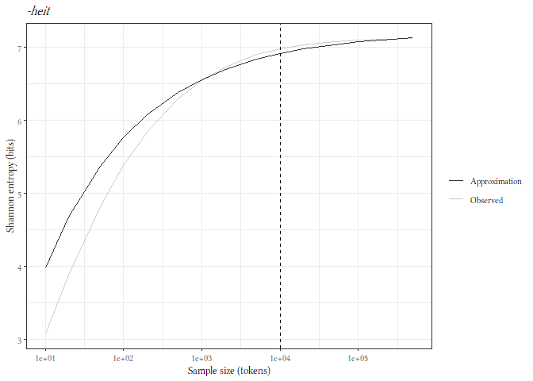
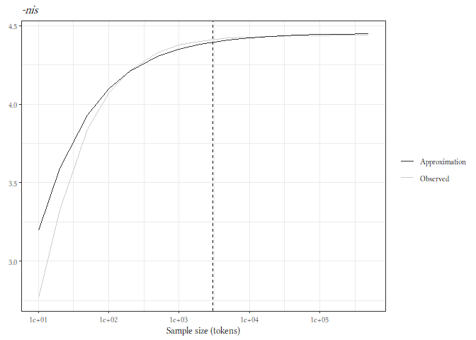
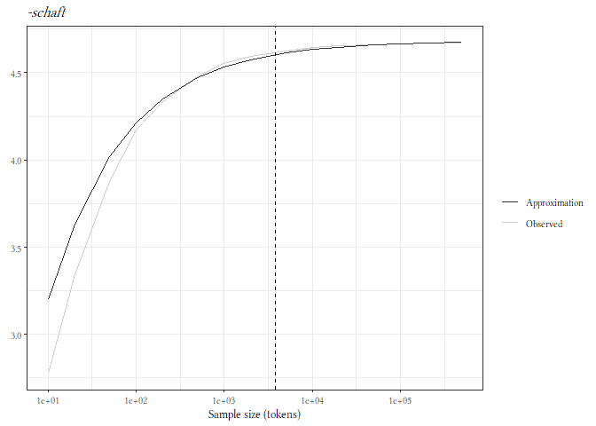
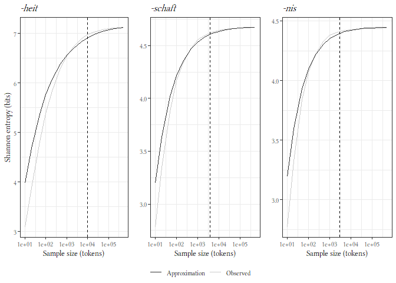

    library(tidyverse)
    library(entropy)
    library(extrafont)
    library(ggsci)
    library(ggpubr)
    loadfonts()

    options(dplyr.summarise.inform = FALSE)
    theme_set(theme_bw(base_size = 10))
    theme_update(text = element_text(family = "Linux Libertine Display G"))

    freqdist_iter_wrepl <- read.csv('../2_interpretability/iterdata/freqdist_iter_500_wrepl.csv', encoding='UTF-8')
    freqdist_iter_wrepl$suffix <- factor(freqdist_iter_wrepl$suffix,
                    levels = c("heit", "schaft", "nis"),
                    labels = c('-heit', '-schaft', '-nis'))

The next block is identical to the code in
`2_interpretability/bootstrap_prod_measures.Rmd`; we’re just making
entropy curves again.

    # Compute entropy for each sample.
    ent_col_wrepl <- freqdist_iter_wrepl %>% 
      group_by(suffix, iter, sample_size) %>% 
      group_map(~entropy.empirical(.x$n_tokens, unit='log2')) %>% 
      unlist()

    # Get a df of the grouping variables as they were used for group_map(),
    # reorder -nis and -schaft so that they match the factor levels,
    # and add the resulting vector as a column.
    ent_iter_wrepl <- freqdist_iter_wrepl %>% 
      select(suffix, iter, sample_size) %>% 
      distinct()
    ent_iter_wrepl <- rbind(
      ent_iter_wrepl[1:7500,],      # heit
      ent_iter_wrepl[15001:22500,], # schaft
      ent_iter_wrepl[7501:15000,]   # nis
    )
    ent_iter_wrepl$ent <- ent_col_wrepl

    ent_summ_wrepl <- ent_iter_wrepl %>% 
      group_by(suffix, sample_size) %>% 
      summarise(
        mean_ent = mean(ent),
        min = min(ent),
        max = max(ent)
      )

Individual plots
================

    exp_fn <- function(x, lambda=1, beta=1){
      return(lambda * (1 - exp(-beta * log(x))))
    }

    # The desired near-zero slope of the tangent line to the curve.
    c <- 1e-5

    # Guess and check parameter values.
    heit_lambda <- 7.2
    heit_beta <- 0.35

    # Predict entropy approx and get sample size for a slope of c.
    heit_pred_ent <- tibble(sample_size = sort(rep(c(1, 2, 5), 5) * c(1e1, 1e2, 1e3, 1e4, 1e5)))
    heit_pred_ent$entropy <- exp_fn(heit_pred_ent$sample_size, lambda = heit_lambda, beta = heit_beta)
    heit_samp <- ((heit_lambda*heit_beta)/c)^(1/(heit_beta+1))

    (plot_heit <- ggplot() +
        geom_line(data=filter(ent_summ_wrepl, suffix == '-heit'), aes(x=sample_size, y=mean_ent, colour='Observed')) +
        geom_line(data=heit_pred_ent, aes(x=sample_size, y=entropy, colour='Approximation')) +
        geom_vline(xintercept = heit_samp, linetype='dashed', size=0.3) +
        scale_x_continuous(trans = 'log10') +
        scale_colour_grey() + 
        labs(x = 'Sample size (tokens)',
             y = 'Shannon entropy (bits)',
             colour = element_blank(),
             title = '-heit') +
        theme(plot.title = element_text(face = 'italic')) +
        NULL)

    # Guess and check parameter values.
    nis_lambda <- 4.45
    nis_beta <- 0.55

    # Predict entropy approx and get sample size for a slope of c.
    nis_pred_ent <- tibble(sample_size = sort(rep(c(1, 2, 5), 5) * c(1e1, 1e2, 1e3, 1e4, 1e5)))
    nis_pred_ent$entropy <- exp_fn(nis_pred_ent$sample_size, lambda = nis_lambda, beta = nis_beta)
    nis_samp <- ((nis_lambda*nis_beta)/c)^(1/(nis_beta+1))

    (plot_nis <- ggplot() +
        geom_line(data=filter(ent_summ_wrepl, suffix == '-nis'), aes(x=sample_size, y=mean_ent, colour='Observed')) +
        geom_line(data=nis_pred_ent, aes(x=sample_size, y=entropy, colour='Approximation')) +
        geom_vline(xintercept = nis_samp, linetype='dashed', size=0.3) +
        scale_x_continuous(trans = 'log10') +
        scale_colour_grey() + 
        labs(x = 'Sample size (tokens)',
             y = element_blank(),
             colour = element_blank(),
             title = '-nis') +
        theme(plot.title = element_text(face = 'italic')) +
        NULL)

    # Guess and check parameter values.
    schaft_lambda <- 4.68
    schaft_beta <- 0.5

    # Predict entropy approx and get sample size for a slope of c.
    schaft_pred_ent <- tibble(sample_size = sort(rep(c(1, 2, 5), 5) * c(1e1, 1e2, 1e3, 1e4, 1e5)))
    schaft_pred_ent$entropy <- exp_fn(schaft_pred_ent$sample_size, lambda = schaft_lambda, beta = schaft_beta)
    schaft_samp <- ((schaft_lambda*schaft_beta)/c)^(1/(schaft_beta+1))

    (plot_schaft <- ggplot() +
        geom_line(data=filter(ent_summ_wrepl, suffix == '-schaft'), aes(x=sample_size, y=mean_ent, colour='Observed')) +
        geom_line(data=schaft_pred_ent, aes(x=sample_size, y=entropy, colour='Approximation')) +
        geom_vline(xintercept = schaft_samp, linetype='dashed', size=0.3) +
        scale_x_continuous(trans = 'log10') +
        scale_colour_grey() + 
        labs(x = 'Sample size (tokens)',
             y = element_blank(),
             colour = element_blank(),
             title = '-schaft') +
        theme(plot.title = element_text(face = 'italic')) +
        NULL)

Combined plot
=============

    ggarrange(plot_heit, plot_schaft, plot_nis,
              common.legend = TRUE,
              legend = 'bottom',
              ncol=3)

    ggsave('imgs/math.pdf', device=cairo_pdf, width=15, height=6, units='cm')
